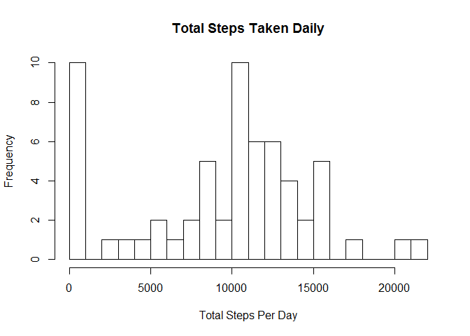

# Reproducible Research: Peer Assessment 1


## Loading and preprocessing the data


```r
library(readr)
```

```
## Warning: package 'readr' was built under R version 3.2.3
```

```r
df <- read_csv("rep_activity.csv")
```

## What is mean total number of steps taken per day?


```r
daily_sum <-tapply(df$steps, df$date, sum, na.rm = TRUE)
hist(daily_sum, breaks = 30, main = "Total Steps Taken Daily", xlab = "Total Steps Per Day")
```

 

##### Mean of the total steps taken each day:


```r
mean(daily_sum)
```

```
## [1] 9354.23
```

##### Median of the total steps taken each day:


```r
median(daily_sum)
```

```
## [1] 10395
```

## What is the average daily activity pattern?

##### A plot of the average steps taken at 5-minute intervals for all days:


```r
plot(tapply(df$steps, df$interval, mean, na.rm = TRUE), type = "l", ylab = "Avg. Steps", xlab = "5 Minute Interval", main = c("Average Steps Taken at 5-Minute Intervals", "(24 Hours)"), ylim = c(0,200))
```

 

##### The 5-minute interval with the highest average steps across all days:


```r
which.max(tapply(df$steps, df$interval, mean, na.rm = TRUE))
```

```
## 835 
## 104
```

## Imputing missing values


##### Number of missing values: 


```r
sum(is.na(df))
```

```
## [1] 2304
```

#### Creating a new dataset replacing the missing step data with the median for that day.


```r
df2 <- df ## duplicating the original dataset 
avg <- mean(df2$steps, na.rm = TRUE)
for(i in 1:nrow(df2)){
  if (is.na(df2$steps[i]) == "TRUE"){
    df2$steps[i] <- avg
  }
}

## Calculating the daily totals
daily_sum2 <-tapply(df2$steps, df2$date, sum, na.rm = TRUE)
hist(daily_sum2, breaks = 30, main = "Total Steps Taken Daily", xlab = "Total Steps Per Day")
```

 

##### Mean of total steps taken per day:


```r
mean(daily_sum2)
```

```
## [1] 10766.19
```

##### Median of total steps taken per day:


```r
median(daily_sum2)
```

```
## [1] 10766.19
```

#### The impact of replacing missing data: 


```r
par(mfrow=c(1,2), mar = c(5,4,3.5,2))
boxplot(daily_sum, main = "With Missing Data")
boxplot(daily_sum2, main = "Replaced Missing Data")
```

 

## Are there differences in activity patterns between weekdays and weekends?


```r
library(lattice)
```

```
## Warning: package 'lattice' was built under R version 3.2.2
```

```r
for(i in 1:nrow(df2)){
  if (weekdays(df2$date[i]) %in% c("Sunday","Saturday")) {
    df2$weekday[i] <- "weekend"
  } else {
    df2$weekday[i] <- "weekday"
  }
}

df2$y <- tapply(df2$steps[df2$weekday == "weekend"], df2$interval[df2$weekday == "weekend"], mean, na.rm = TRUE)

df2$wy <- tapply(df2$steps[df2$weekday == "weekday"], df2$interval[df2$weekday == "weekday"], mean, na.rm = TRUE)

xyplot(y + wy ~ interval | weekday, data = df2, type = "l", layout = c(1,2), ylab = "Steps", xlab = "Interval", main = "Avg Steps Weekend vs Weekday")
```

 
